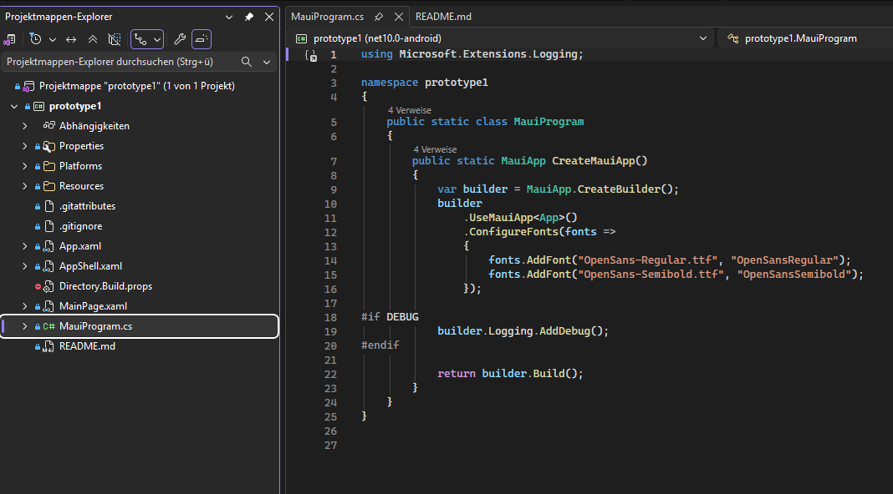
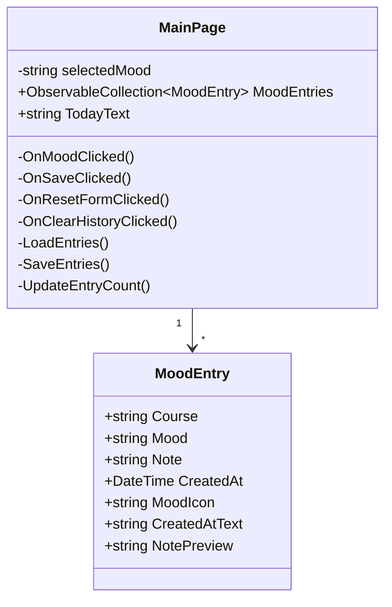
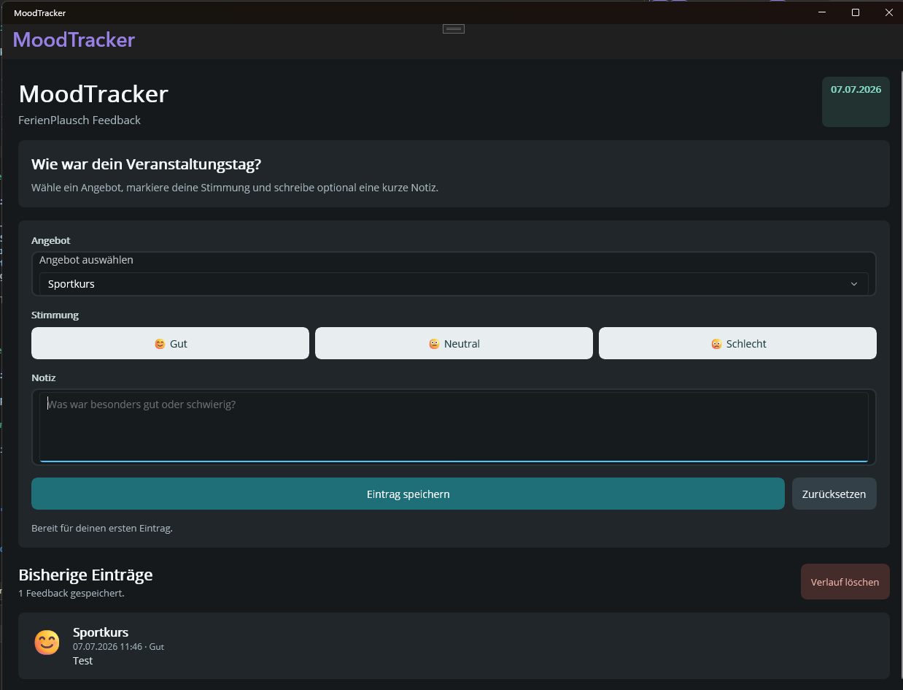
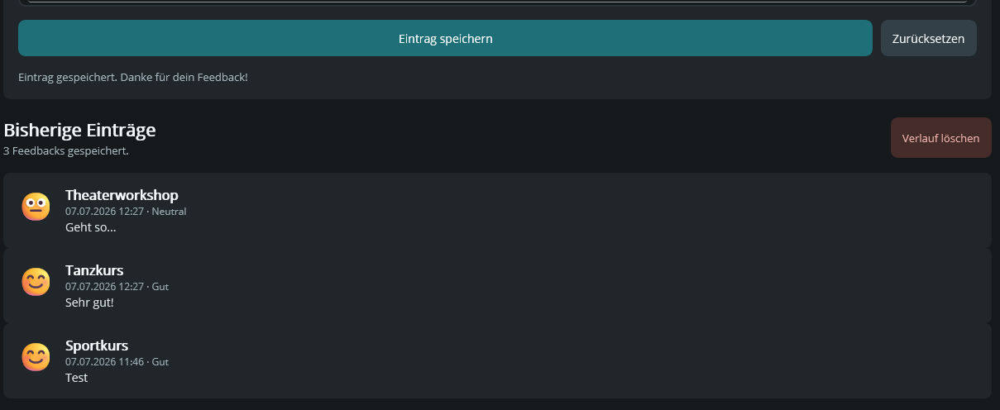

# 📘 Projekt-Journal: MoodTracker

## ℹ️ Info

Dieses Projektjournal dokumentiert die Umsetzung des Prototyps **MoodTracker**. Die App wurde im Rahmen des FerienPlausch-Projekts als einfache Feedback-App erstellt. Teilnehmerinnen und Teilnehmer können ein Angebot auswählen, ihre Stimmung erfassen und optional eine kurze Notiz speichern.

Ziel dieses Journals ist es, den aktuellen Projektstand, wichtige Entscheidungen, technische Herausforderungen und den Fortschritt nachvollziehbar festzuhalten.

**Projektname:** MoodTracker  
**Repository/Projekt:** prototype1  
**Technologie:** C# mit .NET MAUI  
**Zielplattform im Prototyp:** Windows Machine und Android Emulator; Android wurde in Visual Studio erfolgreich gestartet.

---

## Inhaltsverzeichnis

- [📘 Projekt-Journal: MoodTracker](#-projekt-journal-moodtracker)
  - [ℹ️ Info](#️-info)
  - [Tagesaktivitäten](#tagesaktivitäten)
  - [🧩 Phase 1: Setup und Initialisierung](#-phase-1-setup-und-initialisierung)
  - [🧱 Phase 2: Planung](#-phase-2-planung)
    - [📂 Verwendete Datenstruktur](#-verwendete-datenstruktur)
    - [🔷 UML Klassendiagramm](#-uml-klassendiagramm)
    - [🖼️ Layout](#️-layout)
    - [✅ Validierung](#-validierung)
  - [🚀 Phase 3: Umsetzung](#-phase-3-umsetzung)
  - [⚙️ Phase 4: Technische Reflexion](#️-phase-4-technische-reflexion)
  - [🔒 Phase 5: Abschluss und Präsentation](#-phase-5-abschluss-und-präsentation)
  - [📸 Screenshots vom Fortschritt](#-screenshots-vom-fortschritt)
  - [⚠️ Herausforderungen und Blockaden](#️-herausforderungen-und-blockaden)
  - [💻 Besonders erwähnenswerte Code-Beispiele](#-besonders-erwähnenswerte-code-beispiele)
  - [Reflexion](#reflexion)

---

## Tagesaktivitäten

| Datum | Aktivität |
| --- | --- |
| Di, 07.07.2026 | Projekt analysiert und Visual-Studio/.NET-Runtime-Problem untersucht. |
| Di, 07.07.2026 | MoodTracker-Prototyp erstellt: Kursauswahl, Stimmung, Notiz und Verlauf. |
| Di, 07.07.2026 | Windows-Build erfolgreich getestet. Android-Build erfolgreich, Android-Deployment wegen lokaler Emulator-/JDK-Konfiguration blockiert. |
| Di, 07.07.2026 | GitHub-Repository erstellt und Projekt hochgeladen. |
| Di, 07.07.2026 | Projekt von `experiment1` auf `prototype1` umbenannt und Encoding-Fehler korrigiert. |
| Di, 14.07.2026 | Android SDK/JDK-Konfiguration geprüft: gültige JDK-Installation und vorhandenes Android SDK identifiziert. |
| Di, 14.07.2026 | Android Emulator `MoodTracker_API36` mit `avdmanager` ausserhalb des Visual-Studio Device Managers erstellt. |
| Di, 14.07.2026 | App erfolgreich über Visual Studio auf dem Android Emulator gestartet. |
| Di, 14.07.2026 | Android-Deployment-Fix `EmbedAssembliesIntoApk` in der Projektdatei ergänzt und Änderung nach GitHub gepusht. |

---

## 🧩 Phase 1: Setup und Initialisierung

**Was habe ich in Phase 1 umgesetzt:**

- .NET MAUI-Projekt in Visual Studio geöffnet.
- Standard-Startseite geprüft.
- Lokales Problem mit Visual Studio und .NET-Runtime analysiert.
- Fehlerhafte Umgebungsvariable `DOTNET_ROOT` als Ursache für den Windows-Startfehler identifiziert.
- App erfolgreich über **Windows Machine** gestartet.



---

## 🧱 Phase 2: Planung

**Was habe ich in Phase 2 umgesetzt:**

Der Prototyp wurde bewusst einfach gehalten. Es gibt keine API-Anbindung, keine Benutzeranmeldung und kein Administrations-Backend. Die App besteht aus einer Hauptseite mit Formular und Verlauf.

### 📂 Verwendete Datenstruktur

Die App speichert Stimmungseinträge lokal. Ein Eintrag enthält:

```json
[
  {
    "Course": "Sportkurs",
    "Mood": "Gut",
    "Note": "Hat Spass gemacht.",
    "CreatedAt": "2026-07-07T11:46:00"
  }
]
```

Die Datenstruktur wird in folgender C# Klasse abgebildet:

```csharp
public class MoodEntry
{
    public string Course { get; set; } = string.Empty;
    public string Mood { get; set; } = string.Empty;
    public string Note { get; set; } = string.Empty;
    public DateTime CreatedAt { get; set; }

    public string MoodIcon => Mood switch
    {
        "Gut" => "\U0001F60A",
        "Neutral" => "\U0001F610",
        "Schlecht" => "\U0001F641",
        _ => "\u2022"
    };
}
```

Die Speicherung erfolgt mit `Preferences`. Dadurch bleiben Einträge lokal erhalten, auch wenn die App neu gestartet wird.

---

### 🔷 UML Klassendiagramm



---

### 🖼️ Layout

Ich habe mich für ein einseitiges Layout entschieden:

**Bereich 1: Kopfbereich**

- App-Name `MoodTracker`
- Untertitel `FerienPlausch Feedback`
- aktuelles Datum

**Bereich 2: Eingabeformular**

- Auswahl eines Angebots
- Auswahl der Stimmung
- optionale Notiz
- Speichern- und Zurücksetzen-Button

**Bereich 3: Verlauf**

- Liste aller bisherigen Einträge
- Datum, Stimmung, Angebot und Notiz
- Button zum Löschen des Verlaufs



---

### ✅ Validierung

Folgende Felder werden validiert:

| Feld | Regel | Rückmeldung |
| --- | --- | --- |
| Angebot | Muss ausgewählt sein | Dialog: `Bitte wähle zuerst ein Angebot aus.` |
| Stimmung | Muss ausgewählt sein | Dialog: `Bitte wähle deine Stimmung aus.` |
| Notiz | Optional | Keine Validierung nötig |

---

## 🚀 Phase 3: Umsetzung

**Was habe ich in Phase 3 umgesetzt:**

- Standard-`Hello World`-Seite entfernt.
- Eigene MoodTracker-Oberfläche in `MainPage.xaml` erstellt.
- Kursliste mit `Picker` umgesetzt.
- Stimmungsauswahl mit drei Buttons umgesetzt.
- Optionale Notiz mit `Editor` umgesetzt.
- Verlauf mit `CollectionView` umgesetzt.
- Lokale Speicherung mit `Preferences` umgesetzt.
- Projekt in GitHub hochgeladen.
- Projektdateien auf `prototype1` umbenannt.



---

## ⚙️ Phase 4: Technische Reflexion

**Was habe ich in Phase 4 umgesetzt und untersucht:**

- Windows-Build erfolgreich geprüft.
- Android-Build und Android-Deployment erfolgreich geprüft.
- JDK- und Android-SDK-Pfade analysiert und korrekt zugeordnet.
- Android Emulator `MoodTracker_API36` ausserhalb des Visual-Studio Device Managers erstellt, weil dieser Adminrechte verlangte.
- Visual Studio konnte den bereits vorhandenen Emulator über `adb` erkennen und die App starten.
- Fast-Deployment-Problem mit `EmbedAssembliesIntoApk` gelöst.
- Encoding-Problem nach der Umbenennung erkannt und korrigiert.

Das Projekt folgt bewusst einer einfachen Struktur. Es wurde kein separates ViewModel erstellt, weil die Aufgabenstellung eine vereinfachte Architektur erlaubt. Die View und die einfache Logik befinden sich gemeinsam in `MainPage.xaml` und `MainPage.xaml.cs`.

---

## 🔒 Phase 5: Abschluss und Präsentation

**Aktueller Stand:**

- Prototyp ist über Windows und Android Emulator lauffähig.
- GitHub-Repository ist eingerichtet und aktualisiert.
- Kernfunktionen der User Stories sind umgesetzt.
- Android-Deployment wurde über Visual Studio erfolgreich getestet.
- Der Emulator wurde einmalig ausserhalb des Visual-Studio Device Managers erstellt und danach von Visual Studio verwendet.

**Nicht enthalten:**

- API-Anbindung
- User Authentication
- Administrations-Backend

---

## 📸 Screenshots vom Fortschritt

| Datum | Feature | Screenshot |
| --- | --- | --- |
| 07.07.2026 | Startseite |  |
| 07.07.2026 | Eingabeformular |  |
| 07.07.2026 | Verlauf |  |

---

## ⚠️ Herausforderungen und Blockaden

### Android Emulator, JDK und Visual Studio

- Problem: Der Visual-Studio Android Device Manager verlangte Adminrechte. Zusätzlich wurde anfangs eine Java-8-JRE statt einer vollständigen JDK-Installation gefunden.
- Analyse: Ein gültiges JDK lag unter `C:\Program Files\Android\openjdk\jdk-21.0.8`, das Android SDK unter `C:\Program Files (x86)\Android\android-sdk`.
- Lösung: Das Emulator-Profil `MoodTracker_API36` wurde mit `avdmanager` ausserhalb des Visual-Studio Device Managers im Benutzerprofil erstellt.
- Ergebnis: Der Emulator wurde über `adb` als `emulator-5554` erkannt und Visual Studio konnte die App über den grünen Start-Button auf dem Android Emulator starten.
- Zusätzliche Anpassung: In `prototype1.csproj` wurde `EmbedAssembliesIntoApk` für `net10.0-android` gesetzt, damit das Deployment nicht am schnellen Assembly-Deployment scheitert.

### Visual Studio Runtime-Problem

- Problem: Visual Studio meldete, dass eine .NET Desktop Runtime installiert werden müsse.
- Ursache: Eine fehlerhafte `DOTNET_ROOT`-Umgebungsvariable zeigte auf einen unvollständigen lokalen Ordner.
- Lösung: Die fehlerhafte Benutzer-Variable wurde entfernt. Danach konnte die Windows-App gestartet werden.

### Encoding nach Projektumbenennung

- Problem: Nach dem Umbenennen von `experiment1` auf `prototype1` waren Umlaute und Emojis beschädigt.
- Ursache: PowerShell 5.1 hatte UTF-8-Dateien mit falscher Zeichenkodierung neu geschrieben.
- Lösung: Die betroffenen Dateien wurden erneut sauber als UTF-8 geschrieben. In XAML werden Sonderzeichen teilweise als XML-Entities genutzt.

---

## 💻 Besonders erwähnenswerte Code-Beispiele

### Android-Deployment-Fix für Visual Studio

```xml
<PropertyGroup Condition="'$(TargetFramework)' == 'net10.0-android'">
  <EmbedAssembliesIntoApk>true</EmbedAssembliesIntoApk>
</PropertyGroup>
```

Diese Einstellung deaktiviert das schnelle Assembly-Deployment für Android und packt die Assemblies direkt in die APK. Dadurch konnte die App zuverlässig aus Visual Studio auf dem Android Emulator gestartet werden.

### Speichern eines Stimmungseintrags

```csharp
var entry = new MoodEntry
{
    Course = course,
    Mood = selectedMood,
    Note = NoteEditor.Text?.Trim() ?? string.Empty,
    CreatedAt = DateTime.Now
};

MoodEntries.Insert(0, entry);
SaveEntries();
```

### Lokale Speicherung mit Preferences

```csharp
private void SaveEntries()
{
    var serializedEntries = JsonSerializer.Serialize(MoodEntries.ToList());
    Preferences.Set(StorageKey, serializedEntries);
}
```

### Laden gespeicherter Einträge

```csharp
private void LoadEntries()
{
    var storedEntries = Preferences.Get(StorageKey, string.Empty);

    if (string.IsNullOrWhiteSpace(storedEntries))
    {
        return;
    }

    var entries = JsonSerializer.Deserialize<List<MoodEntry>>(storedEntries)
        ?? new List<MoodEntry>();

    foreach (var entry in entries.OrderByDescending(entry => entry.CreatedAt))
    {
        MoodEntries.Add(entry);
    }
}
```

### Validierung vor dem Speichern

```csharp
if (CoursePicker.SelectedItem is not string course)
{
    await DisplayAlertAsync(
        "Angebot fehlt",
        "Bitte wähle zuerst ein Angebot aus.",
        "OK");
    return;
}

if (string.IsNullOrWhiteSpace(selectedMood))
{
    await DisplayAlertAsync(
        "Stimmung fehlt",
        "Bitte wähle deine Stimmung aus.",
        "OK");
    return;
}
```

---

## Reflexion

Das Projekt war hilfreich, um den Ablauf einer kleinen MAUI-App zu verstehen. Besonders wichtig war die Erkenntnis, dass nicht jeder Fehler direkt im eigenen Code liegt. Ein grosser Teil der Arbeit bestand darin, Visual Studio, .NET, Android-Tools und GitHub korrekt einzuordnen. Beim Android-Deployment zeigte sich ausserdem, dass Visual Studio und die Android-Werkzeuge getrennt betrachtet werden können: Der Emulator musste nicht zwingend über den Visual-Studio Device Manager erstellt werden, sondern konnte mit den offiziellen Android SDK Tools im Benutzerprofil angelegt und danach von Visual Studio verwendet werden.

Der MoodTracker-Prototyp erfüllt die wichtigsten User Stories: Stimmung erfassen, Notiz speichern und bisherige Einträge anzeigen. Für eine spätere Weiterentwicklung wären eine echte API-Anbindung, Benutzerverwaltung und ein Administrationsbereich sinnvolle nächste Schritte.
